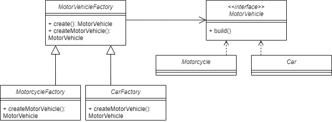

# Factory Pattern

---

## Overview
The **Factory Pattern** is a **creational design pattern** that **defines an interface for creating objects** but lets **subclasses decide which class to instantiate**.

It allows a class to **delegate the instantiation logic** to subclasses, making code more **flexible** and **scalable**.

---

## Real-Life Example: Vehicle Manufacturing

Imagine a vehicle manufacturing system where you need to produce different types of vehicles like **cars** and **motorcycles**.

Instead of hardcoding the creation logic, we use a **Factory** to handle object creation, allowing the system to **easily add new vehicle types** without modifying existing code.



---

## Vehicle Interface
An abstracted common attributed to make coupling objects, creation, and modification easier to do
```java
package creational.factory;

public interface Vehicle {
    void build();
}
```

## Conrete Objects
These are the ones that are being created.
```java
package creational.factory;

public class Motor implements Vehicle {
    @Override
    public void build() {
        System.out.println("Building the Motorcycle");
    }
}

public class Car implements Vehicle {
    @Override
    public void build() {
        System.out.println("Building Car");
    }
}
```

## Base Factory
This is the abstract factory for creating factories of the concrete objects

```java
package creational.factory;

public abstract class BaseFactory {

    public Vehicle create() {
        Vehicle vehicle = createVehicle();
        vehicle.build();
        return vehicle;
    }

    // Abstract method for subclasses to implement
    protected abstract Vehicle createVehicle();
}
```

## Concrete Factories
A factory for each entity to create

```java
package creational.factory;

public class CarFactory extends BaseFactory {
    @Override
    protected Vehicle createVehicle() {
        return new Car();
    }
}

public class MotorFactory extends BaseFactory {
    @Override
    protected Vehicle createVehicle() {
        return new Motor();
    }
}
```

## Example Usage
```java
public class FactoryDemo {
    public static void main(String[] args) {
        BaseFactory carFactory = new CarFactory();
        Vehicle car = carFactory.create(); // Building Car

        BaseFactory motorFactory = new MotorFactory();
        Vehicle motor = motorFactory.create(); // Building the Motorcycle
    }
}

//Building Car
//Building the Motorcycle
```

---

## When to use Factory Pattern
- When your code needs to create objects without specifying the exact class.
- When you want to encapsulate object creation logic in one place.
- When the system needs to easily add new types of objects without modifying existing code.
- When you want to decouple clients from concrete classes, promoting flexibility and scalability.

#### Example scenarios:

- Vehicle manufacturing system (Car, Motorcycle, Truck)
- GUI components (Button, Checkbox, Textbox)
- Database connections or parsers based on type (MySQL, PostgreSQL, MongoDB)

| **Pros**                                      | **Cons**                                           | **Suggestion / Improvement**                                                                                  |
| --------------------------------------------- | -------------------------------------------------- | ------------------------------------------------------------------------------------------------------------- |
| Encapsulates object creation                  | Adds extra complexity                              | Use **Abstract Factory** if you have **families of related objects** to reduce changes in multiple factories. |
| Supports loose coupling                       | Harder to trace actual class being instantiated    | Abstract Factory can centralize creation logic for related objects.                                           |
| Makes code more scalable and flexible         | Can be overkill for simple scenarios               | Only use Abstract Factory when multiple object types vary together.                                           |
| Easier to manage changes in product hierarchy | Requires maintaining additional classes/interfaces | Helps manage multiple product families without touching client code.                                          |
| Supports polymorphism and code reuse          | Slight performance overhead possible               | Abstract Factory keeps client code independent of concrete implementations.                                   |

The other version of Factory Pattern is used when reating families of related or dependent objects without specifying their concrete classes. This will be discussed in the latter.